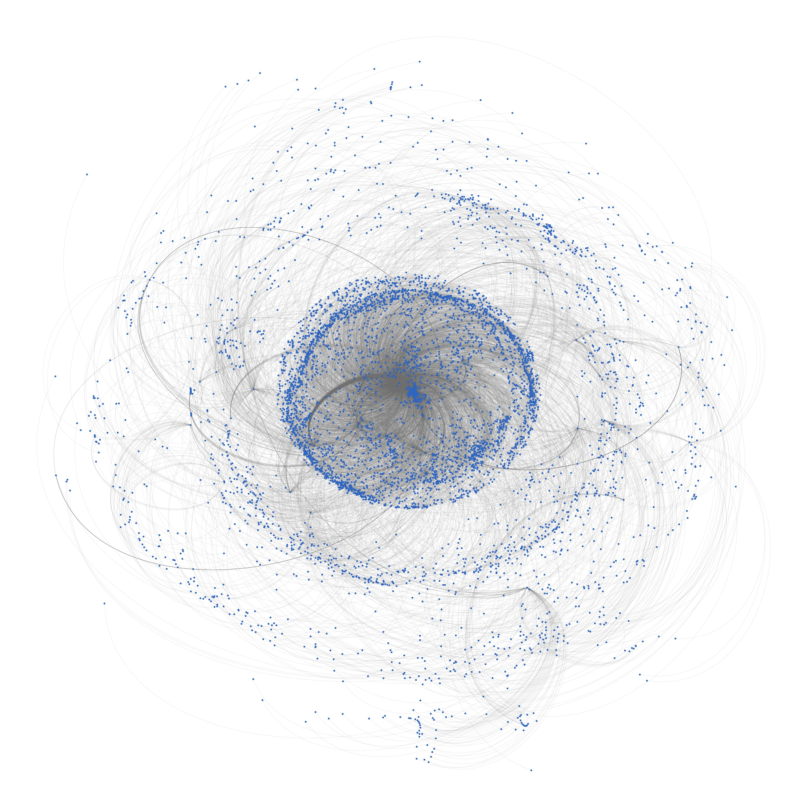
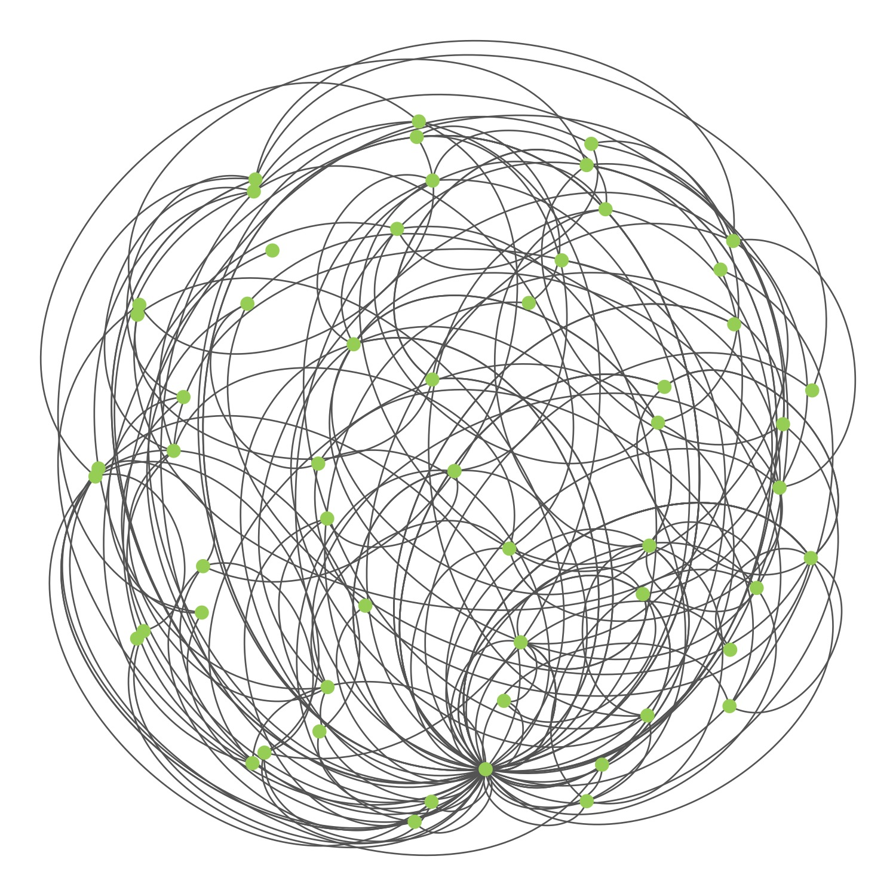

## Visualizing the career of Mark Davis


This project is a Christmas present for a family friend who retired in 2020 from his career as an academic. It relies on data from [Web of Science](https://www.webofknowledge.com) to create a few visualizations to characterize different features of his research. The primary output was a print of the above visualization for Mark and his partner to display in their home.

The current directory structure of this repository is:

```bash
davis-career-viz
    └── scripts
    └── viz
```

### Data
#### Initial WOS search
As there are multiple researchers with the same or similar name (e.g., Davis, M. corresponds to a great many people), I used this search to narrow down to records that definitely belonged to the right person:

`AU=(DAVIS MH  OR DAVIS MARK)  AND OG=(ECKERD COLL  OR UNIVERSITY OF TEXAS AUSTIN  OR INDIANA UNIVERSITY BLOOMINGTON  OR EASTERN ILLINOIS UNIV)  AND WC=(EDUCATION EDUCATIONAL RESEARCH  OR PSYCHOLOGY SOCIAL  OR PSYCHOLOGY MULTIDISCIPLINARY  OR PSYCHOLOGY EDUCATIONAL  OR PSYCHOLOGY  OR BEHAVIORAL SCIENCES  OR CRIMINOLOGY PENOLOGY  OR PSYCHOLOGY APPLIED  OR PSYCHOLOGY DEVELOPMENTAL)`

Perform that search and export all records, selecting the "Full Record and Cited References" option for record content and using the tab-delimited format. 

#### Co-author network

The raw data file is used as input for data_prep.py to develop the node and edge datasets used for the network visualization of his co-authors, both of which will be produced in this location:

```bash
davis-career-viz
    └── data
        └── coauthors
            └── author_network_edges.tsv
            └── author_network_nodes.tsv
```

In this data, each node is a co-author on any of the research output from the WOS search. This includes his partner, Linda, so this provides the opportunity to show their personal relationship in context of their academic output.

#### Citation network

The next project was to develop a citation network with one degree of separation from Mark's papers. I effectively took step forward (who cited those papers) and one step backwards (who did those papers cite) in citations. WOS makes this relatively simple and this is a small enough sample (N=47) that I just did this manually by clicking through each record from the initial search. From each record, I exported the results of the "Times Cited" and "Cited References" links, selecting all records and just "Author, Title, Source" content.   

The filename of each export follows this naming convention: id_type_savedrecs.txt. The id is the WOS ID of the original paper in seed_paper_network_nodes.tsv, and type is either "tc" or "cr" to indicate that it is the results of the "Times Cited" or "Cited References" export, respectively. These files should be organized as:

```bash
davis-career-viz
    └── data
        └── papers
            └── citations
                └── id_type_savedrecs.txt
            └── paper_network_nodes.tsv
            └── seed_paper_network_nodes.tsv
```
Note that one paper has been cited >4000 times! WOS limits the size of each records export to 500 records, so in the case of that paper there are 9 "Times Cited" files. They are named the same way, but numbered, e.g., id_type_savedrecs01.txt, id_type_savedrecs02.txt, etc.

### Scripts
There are two main scripts for this project:
* `data_prep.py` - Prepares the raw export for use by `viz.R`
* `viz.R` - Generates plots from prepared data

```bash
davis-career-viz
    └── scripts
        └── data_prep.py
        └── viz.R
```

### Viz
The output of `viz.R` is saved in the viz folder.

```bash
davis-career-viz
    └── viz
        └── citations_test.jpg
        └── coauthors_ml_diff.jpg
        └── coauthors_ml_same.jpg
        └── coauthors_test.jpg
```
These are included in this README for ease of access.







Here are some preset color palettes to help guide the development of these into a print-worthy version.


### References
Ognyanova, K. (2019) Network visualization with R. Retrieved from www.kateto.net/network-visualization.
